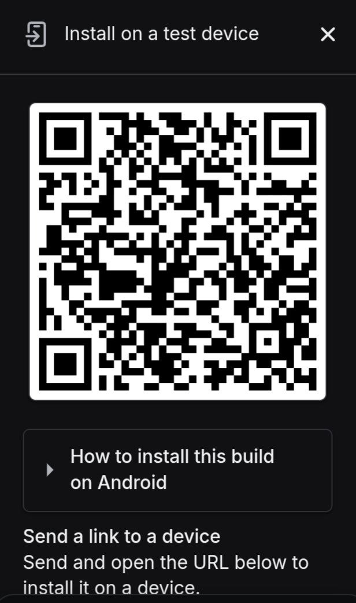

# MonoPay (WIP)

# Check the "Ola" branch to get the latest state. That Branch has been used generating the app for the Monolith & MagicBlocks Blitz Weekend hackathon

**Private, Solana-powered social payments.** MonoPay brings the seamless experience of Google Pay (India) to the Solana ecosystem. It combines a high-speed QR payment interface with a private chat layer, allowing users to transact without exposing their account states or transaction history to the public ledger.

---

## Links

- Website: https://monopay-gilt.vercel.app/
- Demo video: https://www.youtube.com/watch?v=udU0tBlfVmc
- APK, pitch, QR, and project assets: <https://drive.google.com/drive/folders/19820hg8z-comjPrXLVWigOHD76f7F7e_>

## Scan To Access The App

Scan this QR code to open the shared MonoPay app build:



## Demo
<video src="https://github.com/rohaan-sahu/MonoPay/raw/main/MonoPay_Use_1.mp4" width="600" autoplay loop muted playsinline>
</video >

## What MonoPay Does

- Wallet-first onboarding with create wallet, import wallet, and external wallet connection support
- QR request and scan-to-pay flows
- Email OTP authentication with local passcode lock
- Solana payments with public SOL transfers and private USDC rail support
- MonoPay tag resolution for pay-by-username
- Auto-provisioned wallet identity and profile data

## Current Stack

- Expo + React Native + Expo Router
- Solana Web3 / SPL token flows
- Supabase Auth + app data
- MagicBlock private transfer rail for supported USDC flow
- Metaplex identity provisioning
- Zustand state management

---


## Project Structure

To maintain a clean separation of concerns, we follow this strict directory pattern:

* **`app/` (User-Facing):** Handles all routing, layouts, and screen definitions.
* `index.tsx`: The mandatory Lock Screen.
* `(tabs)/`: Main application navigation (Home, Scan, Chat, Profile).


* **`src/` (Services):** Contains all internal logic and helpers.
* `components/`: Reusable UI elements.
* `hooks/`: Custom React hooks (Solana/Anchor interactions).
* `styles/`: Modular style definitions (e.g., `theme.ts`, `homeScreen.ts`).


---


## Get started

1. Install dependencies

   ```bash
   npm install
   ```

2. Start the app

   ```bash
   npx expo start
   ```

In the output, you'll find options to open the app in a

- [development build](https://docs.expo.dev/develop/development-builds/introduction/)
- [Android emulator](https://docs.expo.dev/workflow/android-studio-emulator/)
- [iOS simulator](https://docs.expo.dev/workflow/ios-simulator/)
- [Expo Go](https://expo.dev/go), a limited sandbox for trying out app development with Expo

This project uses [file-based routing](https://docs.expo.dev/router/introduction).


---

## Contributing

MonoPay follows a strict architecture to keep social and payment logic separate.

# Directory & Aliasing
- app/: User-facing routes and screen layouts.

- src/: All logic, hooks, and styles.

-  Alias: Use @mpay for all imports from src.

# Styling Pattern
Each screen requires a dedicated style template from src/styles/. Follow this import convention:

```TypeScript
import { homeScreen as s } from "@mpay/styles/homeScreenStyles";
```
Theming: Extend the base templates in theme.ts rather than hardcoding values.
